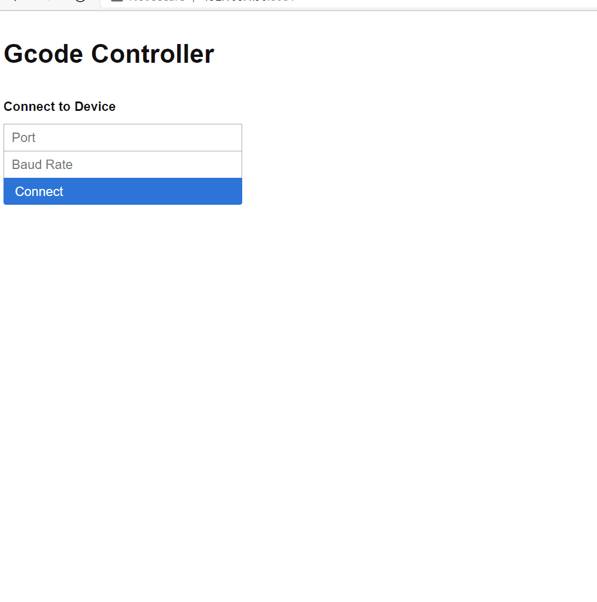

<h1 align="center">Gcode Controller </h1>


> Minimal Web UI for gcode to serial devices.<br /> `GcodeController` is a small app to manage your gcode jobs with the least amount of setup.  Use for Grbl, Marlin, RepRap and other firmware that accepts gcode.

✅ Minimal UI

✅ Start/Stop/Pause a job with realtime progress

✅ Jog

✅ Console to execute gcode

✅ Upload/Manage Files

✅ API First

✅ Detailed Logs

✅ Auto saving configuration

## ✨ Demo



## 🚀 Quick Start

Download the latest release for your OS. Run the executable. 

On Linux/Mac
```sh
chmod u+x GcodeController;
./GcodeController
```

Then go to `http://<device ip>:8081`. It's shown in the console logs.

<details>
	<summary>Grant dialout access *nix based machine for non sudo users (Linux, Mac)</summary>
	
	Check user for dialout access
	
```sh
id -Gn <username>
```

	If missing  `dialout` from the list then

```sh
sudo usermod -a -G dialout <username>
```

	logout and login to ensure access is granted.
</details>

## API Docs

| **Endpoint**         | **Purpose**                              |
| -------------------- | ---------------------------------------- |
| `GET /api/ping`      | Pong                                     |
| `GET /api/serial`    | Current serial device connection         |
| `POST /api/serial`   | Create and open serial device connection |
| `DELETE /api/serial` | Close serial device connection           |
| `PUT /api/serial`    | Send command to serial device            |
| `GET /api/job`       | Job Status                               |
| `POST /api/job`      | Start job                                |
| `PUT /api/job`       | Pause job                                |
| `DELETE /api/job`    | Stop  job                                |
| `POST /api/files`    | Upload single file to be used in job     |
| `GET /api/files`     | Get all files                            |
| `DELETE /api/files`  | Remove single file                       |

## 🤝 Contributing

Contributions, issues and feature requests are welcome.<br />
Feel free to check [issues page](https://github.com/skittleson/GcodeController/issues) if you want to contribute.<br />

## Author

👤 **Spencer Kittleson**

- Twitter: [@skittleson](https://twitter.com/skittleson)
- Github: [@skittleson](https://github.com/skittleson)
- LinkedIn: [@skittleson](https://www.linkedin.com/in/skittleson)
- StackOverflow: [spencer](https://stackoverflow.com/users/2414540/spencer)

## Show your support

⭐️ this repository if this project helped you! It motivates us a lot! 👋

Buy me a coffee ☕: <a href="https://www.buymeacoffee.com/skittles">skittles</a><br />

## Built with ♥

- [VueJs](https://vuejs.org/)
- [EmbedIO](https://unosquare.github.io/embedio/)
- [Picnic CSS](https://picnicss.com/)
- [Grbl](https://github.com/grbl/grbl)

## 📝 License

Copyright © 2021 [Spencer Kittleson](https://github.com/skittleson).<br />
This project is [MIT](https://github.com/skittleson/GcodeController/blob/master/LICENSE) licensed.
